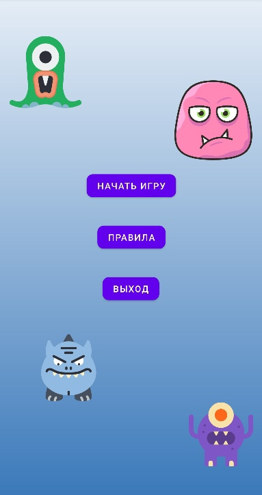

# BattleGame

Telegram: @Four4423

При запуске приложения, есть возможность сразу начать игру, либо изучить правила.

В игре есть 2 кнопки: Атака и Лечение.

При атаке - игрок атакует монстра и наносит ему урон, после - монстр атакует игрока. Нанесенный урон отображается с помощью Toast.

При нажатии на лечение - игрок восстанавливает себе 30% от максимального здоровья. Лечение не завершает ход, после него можно атаковать.
Игра продолжается до момента, пока у игрока или монстра не закончится здоровье.

С краткими правилами можно ознакомиться на соответствующей вкладке

